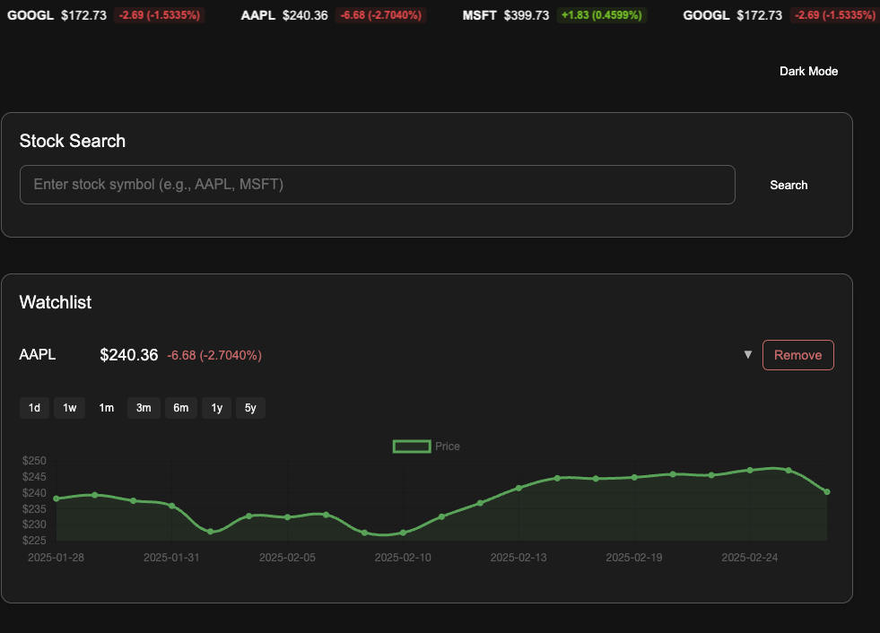
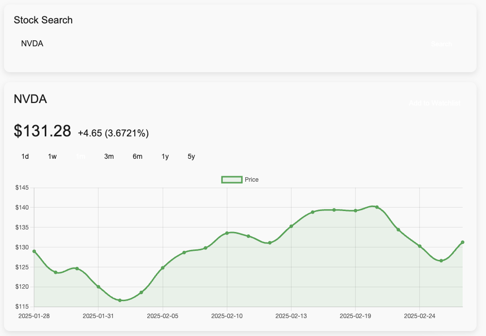

# Automated Stock Market Prediction (ASMP)

## Overview

The Automated Stock Market Prediction (ASMP) application is designed to provide stock search capabilities, historical data analysis, machine learning-based price predictions, and watchlist management. The application is built with **Angular** for the frontend and **FastAPI** for the backend, leveraging **MongoDB** for data storage.

## Features

- **Stock Search**: Search for stocks using ticker symbols.
- **Historical Data Analysis**: Interactive visualizations of stock price trends using D3.js.
- **Machine Learning Predictions**: Forecast stock prices based on historical data.
- **Watchlist Management**: Save and track favorite stocks.
- **Real-Time Updates**: Fetch and display live stock prices.
- **Authentication**: Secure OAuth2.0 login with Google/GitHub.

## Tech Stack

### Frontend

- **Framework**: Angular
- **Data Visualization**: D3.js
- **State Management**: RxJS

### Backend

- **Framework**: FastAPI (Python)
- **Machine Learning**: Scikit-learn or TensorFlow
- **Database**: MongoDB
- **Stock Data APIs**: Alpha Vantage / Yahoo Finance
- **Authentication**: OAuth2.0

## Setup & Installation

### Prerequisites

Ensure you have the following installed:

- **Node.js** (for Angular frontend)
- **Python 3.9+** (for FastAPI backend)
- **MongoDB** (for database storage)
- **Git** (for version control)

### Clone the Repository

```bash
git clone https://github.com/AKolumbic/asmp.git
cd asmp
```

### Frontend Setup

```bash
cd frontend
npm install
ng serve
```

### Backend Setup

```bash
cd backend
python -m venv venv
source venv/bin/activate  # On Windows use: venv\Scripts\activate
pip install -r requirements.txt
```

### To Run Backend from root directory from inside venv

```bash
uvicorn backend.main:app --reload
```

## Screenshots

### Dark Mode



### Light Mode


